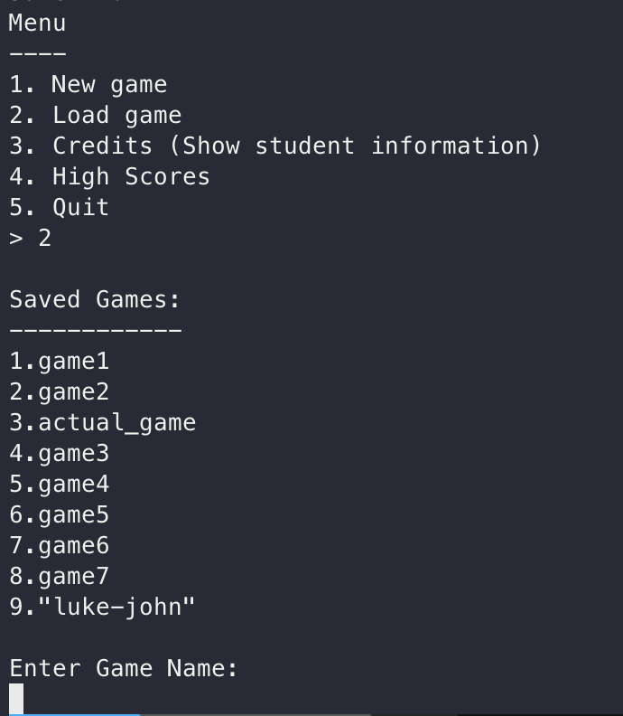

<!-- Improved compatibility of back to top link: See: https://github.com/othneildrew/Best-README-Template/pull/73 -->

<a name="readme-top"></a>

<!--
*** Thanks for checking out the Best-README-Template. If you have a suggestion
*** that would make this better, please fork the repo and create a pull request
*** or simply open an issue with the tag "enhancement".
*** Don't forget to give the project a star!
*** Thanks again! Now go create something AMAZING! :D
-->

<!-- PROJECT SHIELDS -->
<!--
*** I'm using markdown "reference style" links for readability.
*** Reference links are enclosed in brackets [x] instead of parentheses ( ).
*** See the bottom of this document for the declaration of the reference variables
*** for contributors-url, forks-url, etc. This is an optional, concise syntax you may use.
*** https://www.markdownguide.org/basic-syntax/#reference-style-links
-->

[![Contributors][contributors-shield]][contributors-url]
[![Forks][forks-shield]][forks-url]
[![Stargazers][stars-shield]][stars-url]
[![Issues][issues-shield]][issues-url] [![MIT License][license-shield]][license-url] [![LinkedIn][linkedin-shield]][linkedin-url] <!-- PROJECT LOGO --> <br /> <div align="center"> <a href="https://github.com/LukeMacdonald/scrabble">  </a> <h3 align="center">C++ Scrabble Terminal Game</h3> <p align="center"> <br />
<a href="https://github.com/LukeMacdonald/scrabble"><strong>Explore the docs »</strong></a>
<br />
<br />
<a href="https://github.com/LukeMacdonald/scrabble">View Demo</a>
·
<a href="https://github.com/LukeMacdonald/scrabble/issues">Report Bug</a>
·
<a href="https://github.com/LukeMacdonald/scrabble/issues">Request Feature</a>

  </p>
</div>

<!-- TABLE OF CONTENTS -->
<details>
  <summary>Table of Contents</summary>
  <ol>
    <li>
      <a href="#about-the-project">About The Project</a>
      <ul>
        <li><a href="#built-with">Built With</a></li>
      </ul>
    </li>
    <li>
      <a href="#getting-started">Getting Started</a>
      <ul>
        <li><a href="#prerequisites">Prerequisites</a></li>
        <li><a href="#installation">Installation</a></li>
      </ul>
    </li>
    <li><a href="#usage">Usage</a></li>
    <li><a href="#roadmap">Roadmap</a></li>
    <li><a href="#contributing">Contributing</a></li>
    <li><a href="#license">License</a></li>
    <li><a href="#contact">Contact</a></li>
    <li><a href="#acknowledgments">Acknowledgments</a></li>
  </ol>
</details>

<!-- ABOUT THE PROJECT -->

## About The Project

<div align=center >


<br/><br/>
The C++ Scrabble Terminal Game is a console-based implementation of the classic word game Scrabble. Players can enjoy the challenge of forming words using letter tiles on a virtual board.
</div>

<p align="right">(<a href="#readme-top">back to top</a>)</p>

### Built With

<div style="column-count: 2; -webkit-column-count: 2 -moz-column-count: 2;">

- [![C++][C++-badge]][C++-url]
- [![Jira][Jira-badge]][Jira-url]

</div>

<p align="right">(<a href="#readme-top">back to top</a>)</p>

<!-- GETTING STARTED -->

## Getting Started

### Prerequisites

- [c++ compiler](https://code.visualstudio.com/docs/languages/cpp)

### Installation

1. Clone the repo
   ```sh
   git clone https://github.com/LukeMacdonald/scrabble.git
   ```
2. Compile scrabble game
   ```sh
   make
   ```
3. Start the game
   ```sh
   ./scrabble
   ```

<p align="right">(<a href="#readme-top">back to top</a>)</p>

<!-- USAGE EXAMPLES -->

## Usage

Players take turns forming words on the virtual Scrabble board using letter tiles drawn randomly from a pool. Each tile has a corresponding point value, and players aim to maximize their score by strategically placing tiles to create high-scoring words.

### Supports 2 Player


Players can enjoy the game with friends or family by taking turns on the same terminal. The game manages player turns and tile distribution automatically.

#### Dictionary Support


The game includes a built-in dictionary to validate player words and ensure they are acceptable according to Scrabble rules. Invalid words are rejected, prompting players to try again.

#### Scoring System


The game calculates scores based on the point values of tiles used.
The program will keep track of all player scores and a list of the highest scores achieve in scrabble with be displayed.

#### Save and Load



Players may have the option to save their current game state and resume it later, providing flexibility and convenience for longer play sessions.

<p align="right">(<a href="#readme-top">back to top</a>)</p>

#### Game Mechanics

Below are the allowed commands when playing scrabble:

```sh
place TILE at GRID_LOCATION  # place tile on board
place done                   # indicate all desired tiles have been placed
replace TILE                 # replaces selected tile with a different one in the tilebag
save GAME_NAME               # save and exit game
hand                         # show players current hand
pass                         # skip turn
help                         # displays lists of current available commands
```

<!-- ROADMAP -->

## Roadmap

- [x] Srabble Tilebag
  - [x] Implement storing all tiles used in game
  - [x] Implement randomly selecting tile from bag
  - [x] Implement swapping a tile between player hand and bag
- [x] Player Hand
  - [x] Implement select tile from hand
- [x] Game Mechanics
  - [x] Implement placing tile on specific grid location
  - [x] Position validation
  - [x] Implement dictionary mechanics for work check
  - [x] Coloured terminal
- [x] Save Game
- [x] Load Game
- [x] Display High Scores

See the [open issues](https://github.com/LukeMacdonald/scrabble/issues) for a full list of proposed features (and known issues).

<p align="right">(<a href="#readme-top">back to top</a>)</p>

<!-- CONTRIBUTING -->

## Contributing

Contributions are what make the open source community such an amazing place to learn, inspire, and create. Any contributions you make are **greatly appreciated**.

If you have a suggestion that would make this better, please fork the repo and create a pull request. You can also simply open an issue with the tag "enhancement".
Don't forget to give the project a star! Thanks again!

1. Fork the Project
2. Create your Feature Branch (`git checkout -b feature/AmazingFeature`)
3. Commit your Changes (`git commit -m 'Add some AmazingFeature'`)
4. Push to the Branch (`git push origin feature/AmazingFeature`)
5. Open a Pull Request

<p align="right">(<a href="#readme-top">back to top</a>)</p>

## Contact

Luke Macdonald - lukemacdonald21@gmail.com.com

Project Link: [https://github.com/LukeMacdonald/scrabble](https://github.com/LukeMacdonald/scrabble)

<p align="right">(<a href="#readme-top">back to top</a>)</p>

<!-- MARKDOWN LINKS & IMAGES -->
<!-- https://www.markdownguide.org/basic-syntax/#reference-style-links -->

[contributors-shield]: https://img.shields.io/github/contributors/LukeMacdonald/scrabble.svg?style=for-the-badge
[contributors-url]: https://github.com/LukeMacdonald/scrabble/graphs/contributors
[forks-shield]: https://img.shields.io/github/forks/LukeMacdonald/scrabble.svg?style=for-the-badge
[forks-url]: https://github.com/LukeMacdonald/scrabble/network/members
[stars-shield]: https://img.shields.io/github/stars/LukeMacdonald/scrabble.svg?style=for-the-badge
[stars-url]: https://github.com/LukeMacdonald/scrabble/stargazers
[issues-shield]: https://img.shields.io/github/issues/LukeMacdonald/scrabble.svg?style=for-the-badge
[issues-url]: https://github.com/LukeMacdonald/scrabble/issues
[license-shield]: https://img.shields.io/github/license/LukeMacdonald/scrabble.svg?style=for-the-badge
[license-url]: https://github.com/LukeMacdonald/scrabble/blob/master/LICENSE.txt
[linkedin-shield]: https://img.shields.io/badge/-LinkedIn-black.svg?style=for-the-badge&logo=linkedin&colorB=555
[linkedin-url]: https://linkedin.com/in/luke-macdonald-292a4a208
[product-screenshot]: images/screenshot.png
[C++-badge]: https://img.shields.io/badge/c++-%2300599C.svg?style=for-the-badge&logo=c%2B%2B&logoColor=white
[C++-url]: https://cplusplus.com/doc/tutorial/
[Jira-badge]: https://img.shields.io/badge/jira-%230A0FFF.svg?style=for-the-badge&logo=jira&logoColor=white
[Jira-url]: https://www.atlassian.com/software/jira
